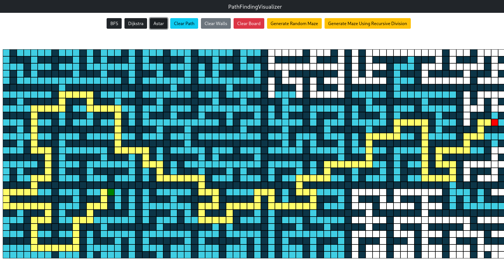

# Pathfinding Visualizer



### [LIVE DEMO](https://glowfi.github.io/pathviz)

## Shortest Path Algorithms

-   Dijkstra
-   DFS
-   BFS
-   Greedy BFS
-   A\* with manhatten distance heuristic

## Maze Generating Algorithms

-   Recursive division
-   Randomized maze

## Build Guide

```sh
git clone https://github.com/baeharam/Pathfinding-Visualizer
cd Pathfinding-Visualizer
rm package-lock.json
yarn install
yarn start
```
